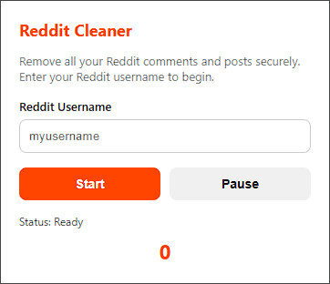

# Reddit Cleaner

**Reddit Cleaner** is a Chrome extension that allows you to bulk delete all your Reddit comments and posts directly from your user overview on [old.reddit.com](https://old.reddit.com).

---

## ✨ Features

- 🧹 Automatically deletes all posts and comments
- ⏸️ Pause and resume at any time
- 🔢 Live counter of deleted items per page.
- ✅ Secure: runs in your browser, no third parties login required
- 🎨 Clean, modern UI
- 🧠 Remembers your username and session state

---

## 📦 Installation

(Download the zip, extract the folder and drag it to the chrome://extensions page)

1. Clone or download this repository.
2. Go to `chrome://extensions/` in your browser.
3. Enable **Developer mode**.
4. Click **Load unpacked** and select the folder.

---

## 🚀 How to Use

1. Open the extension from the Chrome toolbar.
2. Enter your Reddit username (without `u/`).
3. Click **Start** – a new tab will open your profile overview.
4. The extension will automatically begin deleting.
5. Use the **Pause** button at any time to stop the process.
6. If it stops working after pausing, delete the extension and upload it again.

---

## 🛟 Disclaimer

This tool is client-side only and requires no login or API tokens.  
Use at your own risk – deletions are permanent.

---

## 📄 License

MIT License
